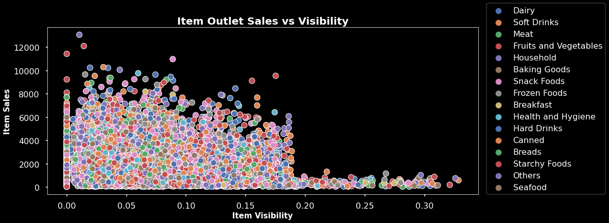
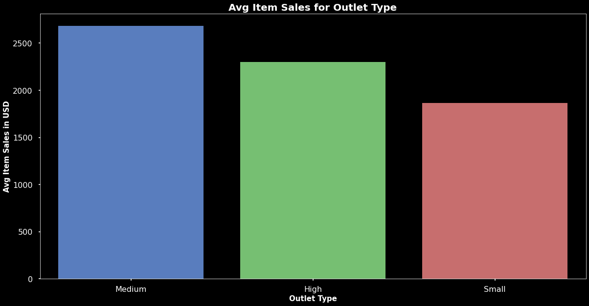

# Prediction of Outlet Sales

### Outlet Sales using Linear Regression and Decision Tree Models

##### Author: Robert Yonce

### Business Problem
  - Create a model to help predict the future Item Outlet Sales 

### Data
  - Sales Data used: https://docs.google.com/spreadsheets/d/e/2PACX-1vTOdd9ucw6tCewOdXmi_zGCnXLdAtUKs1-k5KgSD6TDSkPx6z4ptifobdRcUE-JYhX6IIBziuMvQoVZ/pub?output=csv
  
### Methods
- To fill in the missing values, I used the most frequent method for categories and the median involving any numbers.
	- These processes were chosen as they are simple but effective ways to help fill out the entire data set.
- From there I prepped the data so I could test models on the data given to help see which model would help predict from future data given.
	- The two models tested were Linear Regression and Decision Tree Model.

### Visuals

- Item Visibility with Item Sales
	- Many items have low visibility but high sales! Many items don't have a visibility over 20%. 
	- Could break down more for individual item types but great start to understand the products we are selling. 
	- Does not show a correlation for Item Sales and Visibility
	

- Outlet Type with Averages Sales
	- From the graph, we are shown the Medium Outlet Types have the highest average followed by High Outlet. 
	- This is helpful to understand where the most money is being generated.
	
### Results of Models
- The Decision Tree Model was chosen for this set of data
- Decision Tree Model Test Scores
	- MAE(Mean Absolute Error) : 738.35
		- This is the average amount of dollars the model could be away from the correct data on new salas data.	
	- RMSE(Root Mean Squared Error) : 1,057.44
		- This is the average squared amount, meaning this number is slightly higher as their were some test data that had higher variance from predictions. It impacts the total dollars more for being further away.
	
	- These two metrics can help us predict new sales data within 1,100 dollars.

### Recommendations
- I would recommend checking other models to see if we can improve out data even more. Also having more data is always welcome!

### Next Steps
- Include more data into our data set and run more models.

### For Further Information
- For futher questions, please email Robert at robertyonce10@gmail.com
